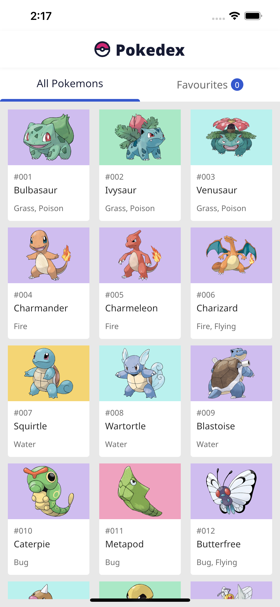
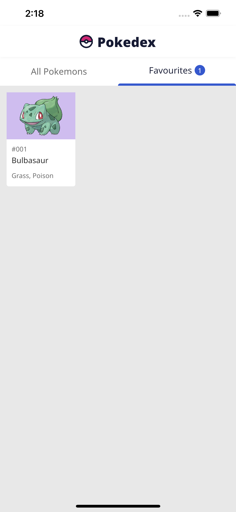
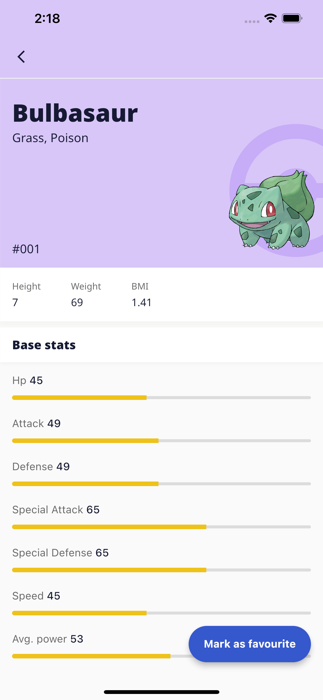

# Pokedex

This Pokedex app is built with Flutter and uses Flutter Bloc for state management.

Pokedex is a mobile app that allows interacting with pokemons.

## Screenshots

### Splash

### Home & Favourites

&nbsp;&nbsp;&nbsp;&nbsp;&nbsp;&nbsp;&nbsp;&nbsp;

### Pokemon Details Screen

dependencies:

    cupertino_icons: ^1.0.2
    flutter_gen: ^5.1.0+1
    flutter_svg: ^1.1.6
    logger: ^1.1.0
    dio: ^4.0.6
    equatable: ^2.0.5
    get_it: ^7.2.0
    cached_network_image: ^3.2.3
    flutter_bloc: ^8.1.1
    hive_flutter: ^1.1.0
    shared_preferences: ^2.0.15
    mockito: ^5.3.2
    fluttertoast: ^8.1.2

dev_dependencies:

    build_runner:
    flutter_gen_runner:
    hive_generator:

## ✨ Requirements

- Any Operating System (ie. MacOS X, Linux, Windows)
- Any IDE with Flutter SDK installed (ie. Android Studio, VSCode, IntelliJ, etc)
- A little knowledge of Dart and Flutter
